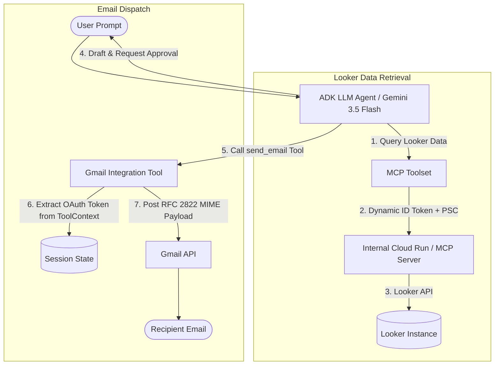

# Looker MCP Agent with Internal Cloud Run & Gmail Integration

An extended AI Agent built using the **Google Agent Development Kit (ADK)** and **Model Context Protocol (MCP)**, based on the Google Cloud Blog post:  
👉 **[Connecting Looker to Gemini Enterprise with MCP Toolbox and ADK](https://cloud.google.com/blog/products/business-intelligence/connecting-looker-to-gemini-enterprise-with-mcp-toolbox-and-adk?e=48754805)**

---

## 🚀 Key Enhancements

This repository builds upon the official Looker MCP & ADK guide by introducing two major enterprise enhancements:

1. 🔒 **Internal Access to Cloud Run (Private Service Connect & Private DNS)**
   - **PSC Network Attachment**: Configured via `.agent_engine_config.json` to allow Agent Engine to reach private Cloud Run endpoints over Private Service Connect.
   - **Private DNS Peering**: Resolves internal hostnames (e.g., `https://looker.mytest.local/mcp`).
   - **Dynamic GCP ID Token Authentication**: Automatically injects Bearer ID tokens fetched via `google.oauth2.id_token` into MCP requests.
   - **Custom HTTPX Transport**: Configures SSL context handling for internal certificate verification and custom HTTPX client instantiation.

2. 📧 **Direct Gmail Integration (`send_email` Tool)**
   - Custom ADK tool enabling the agent to draft and send Looker query results and summaries via email.
   - **Session OAuth Token Extraction**: Dynamically retrieves the user's active Google OAuth token (`ya29...`) from the ADK `ToolContext` state.
   - **MIME RFC 2822 Encoding**: Constructs URL-safe Base64 encoded raw email payloads for the Gmail API (`/v1/users/me/messages/send`).
   - **Automatic Scope Diagnostics**: Inspects active OAuth token scopes via Google TokenInfo API if permission issues arise (e.g. verifying `https://www.googleapis.com/auth/gmail.send`).

---

## 📐 Architecture Overview



---

## 📁 Repository Structure

```
.
├── .agent_engine_config.json   # Agent Engine PSC & Private DNS configuration
├── README.md                   # Project documentation
├── .gitignore                  # Root git ignore rules
└── looker-agent-email2/        # Agent package
    ├── agent.py                # Core ADK agent, MCP setup, & send_email tool
    ├── requirements.txt        # Project dependencies
    ├── .env.example            # Environment variables template
    ├── .adkignore              # ADK deployment ignore rules
    ├── .gcloudignore           # GCloud deployment ignore rules
    └── .gitignore              # Package-specific git ignore rules
```

---

## 🛠️ Setup & Configuration

### Prerequisites
- Python 3.10+
- GCP Project with Vertex AI & Agent Engine enabled
- Private Service Connect (PSC) Network Attachment set up for Cloud Run
- OAuth 2.0 Client with Gmail API scope (`https://www.googleapis.com/auth/gmail.send`)

### 1. Installation
Clone the repository and install dependencies:

```bash
git clone git@github.com:leafyexb/looker-mcp.git
cd looker-mcp/looker-agent-email2

python3 -m venv .venv
source .venv/bin/activate
pip install -r requirements.txt
```

### 2. Environment Variables
Copy `.env.example` to `.env` and set your GCP configuration:

```bash
cp .env.example .env
```

Example `.env` configuration:
```env
GOOGLE_GENAI_USE_VERTEXAI=1
GOOGLE_CLOUD_PROJECT=your-gcp-project-id
GOOGLE_CLOUD_LOCATION=us-central1
DEFAULT_RECIPIENT_EMAIL=user@example.com
```

### 3. Agent Engine PSC Configuration (`.agent_engine_config.json`)
Ensure `.agent_engine_config.json` is located at the root of the project to configure PSC network attachments and private DNS peering:

```json
{
  "psc_interface_config": {
    "network_attachment": "projects/YOUR_PROJECT/regions/us-central1/networkAttachments/YOUR_ATTACHMENT",
    "dns_peering_configs": [
      {
        "domain": "looker.mytest.local.",
        "target_project": "YOUR_PROJECT",
        "target_network": "YOUR_VPC"
      }
    ]
  }
}
```

---

## 🏃 Usage & Testing

### Running Locally
To test the agent locally:

```bash
python looker-agent-email2/agent.py
```

### Deploying to Vertex AI Agent Engine
Deploy the agent to Vertex AI Agent Engine using the ADK CLI with `.agent_engine_config.json`:

```bash
export PROJECT_ID="your-gcp-project-id"

adk deploy agent_engine \
  --project $PROJECT_ID \
  --region us-central1 \
  --display_name "Looker Agent Internal" \
  --agent_engine_config_file=.agent_engine_config.json \
  --agent_engine_id=YOUR_AGENT_ENGINE_ID \
  looker-agent-email2
```

> **Note**: Update `--project`, `--region`, `--display_name`, and `--agent_engine_id` (omit `--agent_engine_id` if creating a new agent engine resource) as needed for your environment.

### Registering with Gemini Enterprise

Once deployed to Agent Engine, register the provisioned reasoning engine agent with your Gemini Enterprise assistant app via the Discovery Engine API:

```bash
export PROJECT_NUMBER="YOUR_PROJECT_NUMBER"
export REASONING_ENGINE="projects/YOUR_PROJECT_NUMBER/locations/us-central1/reasoningEngines/YOUR_REASONING_ENGINE_ID"
export DISPLAY_NAME="Looker Agent Internal"
export DESCRIPTION="Looker's MCP Capability"
export TOOL_DESCRIPTION="Looker's Query Engine is used to answer Ecommerce questions."
export AS_APP="YOUR_GEMINI_ENTERPRISE_APP_ID"

curl -X POST \
  -H "Authorization: Bearer $(gcloud auth print-access-token)" \
  -H "Content-Type: application/json" \
  -H "X-Goog-User-Project: ${PROJECT_NUMBER}" \
https://discoveryengine.googleapis.com/v1alpha/projects/${PROJECT_NUMBER}/locations/global/collections/default_collection/engines/${AS_APP}/assistants/default_assistant/agents \
  -d '{
      "displayName": "'"${DISPLAY_NAME}"'",
      "description": "'"${DESCRIPTION}"'",
      "adk_agent_definition": {
        "tool_settings": {
          "tool_description": "'"${TOOL_DESCRIPTION}"'"
        },
        "provisioned_reasoning_engine": {
          "reasoning_engine":
            "'"${REASONING_ENGINE}"'"
        }
      }
  }'
```

> **Note**: Update `PROJECT_NUMBER`, `REASONING_ENGINE`, `DISPLAY_NAME`, `DESCRIPTION`, `TOOL_DESCRIPTION`, and `AS_APP` with your environment values.


---

## 🔗 Reference
- Google Cloud Blog: [Connecting Looker to Gemini Enterprise with MCP Toolbox and ADK](https://cloud.google.com/blog/products/business-intelligence/connecting-looker-to-gemini-enterprise-with-mcp-toolbox-and-adk?e=48754805)
- [Google Agent Development Kit (ADK) Documentation](https://github.com/google/adk)
- [Model Context Protocol (MCP)](https://modelcontextprotocol.io/)
